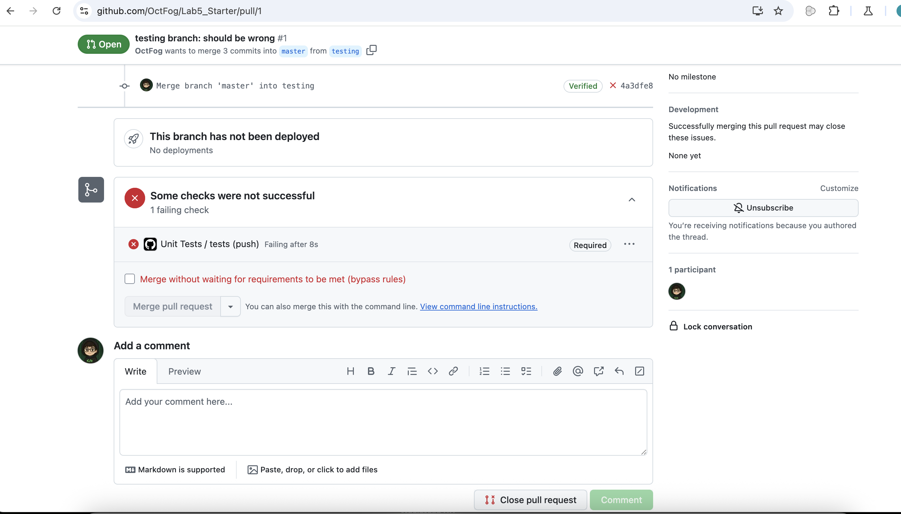
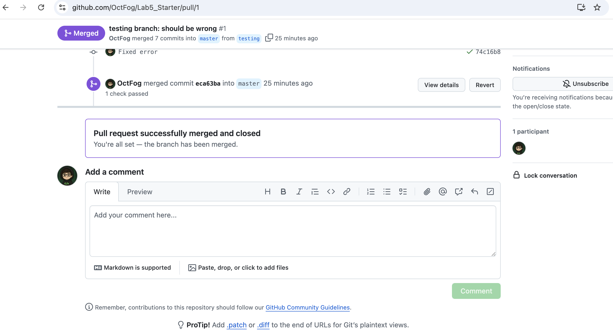

# Lab 5

## Pairing
- **Xiaogeng Xu**
- **Aarav Vidhawan**

## Thinking on Unit Test
### 1. Would you use a unit test to test the “message” feature of a messaging application? Why or why not?

Answer:
No, because the “message” feature is made up of many parts working together, like typing a message, sending it, and saving it. A unit test is best for testing one small piece of code, not a full feature. This kind of feature is better tested with a bigger test that checks how everything works together.

### 2. Would you use a unit test to test the “max message length” feature of a messaging application? Why or why not?

Answer:
Yes, because the “max message length” feature is just one small part of the code. It checks if a message is too long. You can test it by itself without needing to test the whole app, which is perfect for a unit test.

## GitHub Pages
- 👉 [Expose](https://octfog.github.io/Lab5_Starter/expose)
- 👉 [Explore](https://octfog.github.io/Lab5_Starter/explore)

## Screenshots
### myError

### merged
